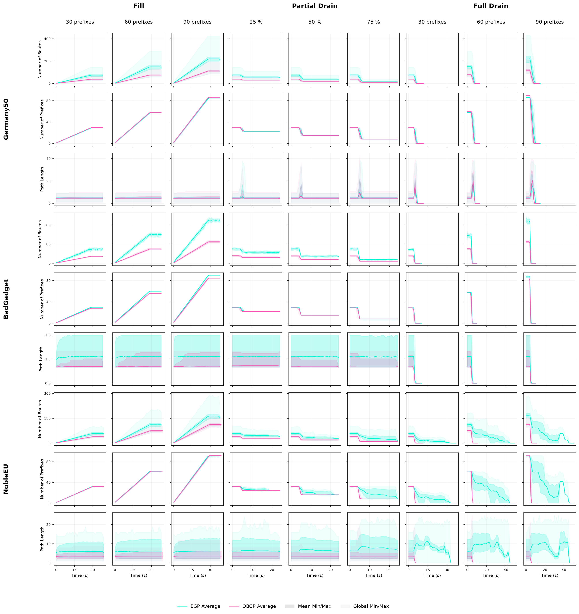

# Figures

Figures for the experiments in
[*Making BGP-4 More Efficient and Oscillation-Free*](https://doi.org/10.23919/IFIPNetworking70592.2026.11578986)
(IFIP Networking 2026). They compare OBGP with unmodified GoBGP. For an overview of the
project, see the [main README](../README.md).

## Overview

[`summary.png`](summary.png) is Fig. 2 of the paper. It combines all topologies and scenarios
in one figure.

## Per-topology figures

| Topology | Fill | Partial drain | Full drain |
|---|---|---|---|
| `germany50`: 50 nodes, no policy cycles (control topology) | [PDF](Germany50/Fill.pdf) | [PDF](Germany50/PartialDrain.pdf) | [PDF](Germany50/FullDrain.pdf) |
| `BAD GADGET`: 4 ASes, one preference cycle | [PDF](BadGadget/Fill.pdf) | [PDF](BadGadget/PartialDrain.pdf) | [PDF](BadGadget/FullDrain.pdf) |
| `noble-eu`: 28 nodes, two preference cycles | [PDF](NobleEU/Fill.pdf) | [PDF](NobleEU/PartialDrain.pdf) | [PDF](NobleEU/FullDrain.pdf) |

The scenarios are:

- **Fill:** start from an empty network and announce prefixes for 30 s, up to about 30, 60,
  or 90 prefixes.
- **Partial drain:** from a steady state with about 30 prefixes, withdraw 25 %, 50 %, or 75 %
  of them.
- **Full drain:** from a steady state with about 30, 60, or 90 prefixes, withdraw all of them.

## Reading the figures

Each PDF has one column per scenario variant and one row per metric:

| Row | Metric |
|---|---|
| Number of Routes | Paths in the Loc-RIB |
| Number of Prefixes | Destinations in the Loc-RIB |
| Minimum / Average / Maximum Path Length | AS-hop count of the paths in the Loc-RIB |

BGP and OBGP are drawn on top of each other. For every sample:

- the **line** is the average over all monitored routers;
- the **dark band** spans the mean minimum to the mean maximum over routers, where each
  router's minimum and maximum are taken across the five runs;
- the **light band** is the global minimum and maximum over all routers and runs.

Only routers that do not originate prefixes are monitored. The RIB of each router was
sampled once per second.

## Data

The figures show the dataset
[`results/public/ifip-networking-2026`](../results/public/ifip-networking-2026). They were made
with the plotting scripts of the release
[`ifip-networking-2026`](https://github.com/Stinktopf/gobgp/releases/tag/ifip-networking-2026).
